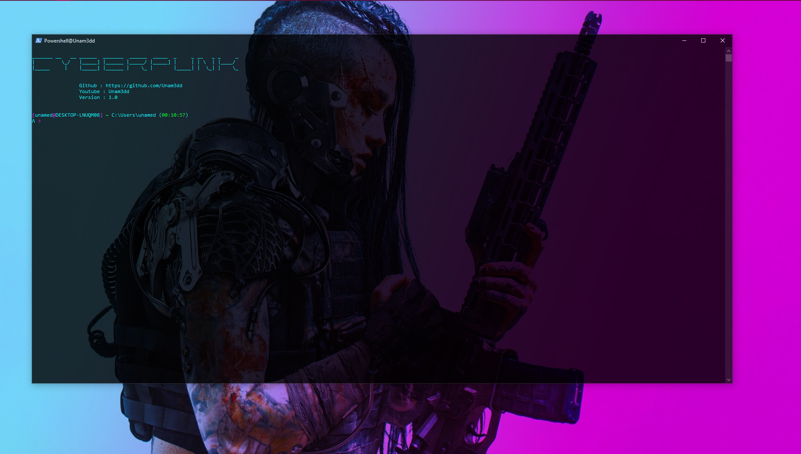

# CyberPowerShellProfile
My Powershell Profile &lt;3 with Cool Function Version (Beta 0.1)

# ScreenShot

# How to Install ?
    1. executing a powershell as administrator.
    2. run this command :
                        1) Set-ExecutionPolicy Unrestricted
                        2) Install-Module -Name "PSWriteColor"
                        
    3. download this repo via the git clone command or download it as a zip file.
    4. in your Documents if you have a folder named "WindowsPowerShell" copy and paste "Microsoft.PowerShell_profile.ps1" and "service_port.txt", in case you don't have the folder "WindowsPowerShell" create it and do the same operation above
    
    5. (Other Method)
    there is also a second method to install it : open a powershell as administrator and make this command
    "notepad $PROFILE" then paste the contents of the .ps1 file and copy and paste the file service_port.txt into the WindowsPowerShell folder which is in this location 
    C:\Users\USER\Documents\WindowsPowerShell\
    
    

# Documentations :
    Get-MyIp() / for return your public ip
    Get-GeoIP() / Get Your Location by your public ip
    GeoIP($IP) / Get Location of $IP
    HttpGet([String]$URI) / Send HTTP Get Requests, return results is same as Invoke-WebRequest
    TryPort($hostname,$port,[int32]$tiemout) / Check if Port is Open
    PortScan($IP,$MAXPORT,[in32]$TIMEOUT) / Simple PortScanner with Timeout
    ReverseShell([String]$LHOST,[int]$LPORT) / Simple Function for Reverse Shell
  
  in more features in the next version
