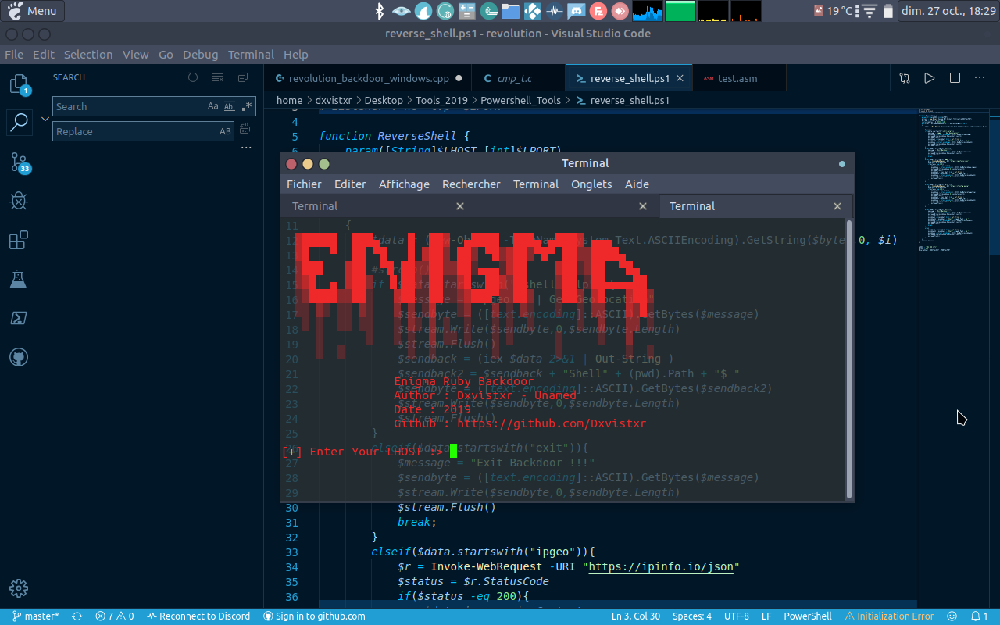

# EnigmaReverseShell
Ruby Reverse Shell For GNU Linux/Mac OSX System

## Setup Commands :
    Debian & Ubuntu Etc... : apt update && apt install ruby ruby-dev gem
    Mac OSX : brew update && brew install gem
