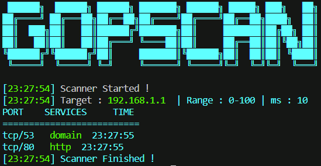

# GoPscan
Portscanner in Golang

## Requirements :
  go get -v github.com/Unam3dd/GServ

## Compile :
  go build GoPscan.go

## Usage:
  usage   : GoPscan.exe ip 0-range ms

## Exemple :
  GoPscan.exe 192.168.1.1 1000 10

## Help :
  GoPscan.exe -h
  GoPscan.exe --help
  GoPscan.exe help

