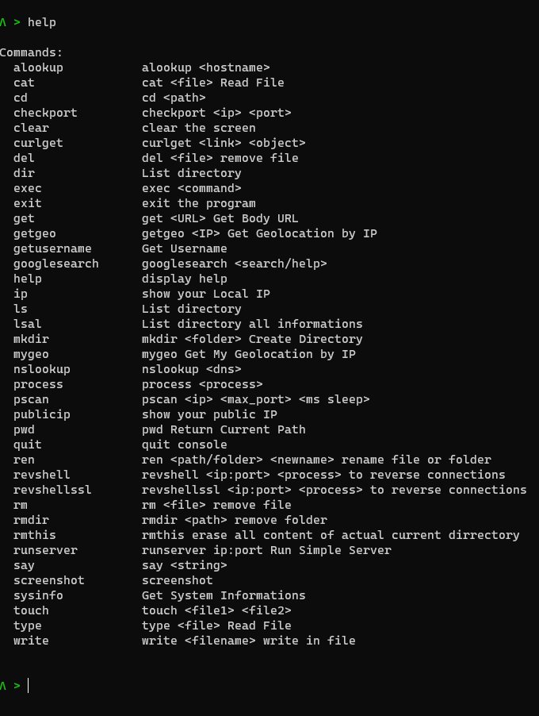

# UnaTerm
Simple Terminal made with golang (Beta Version)

## Install
    go get -v github.com/zhaopuyang/golang-tts
    go get -v github.com/rocketlaunchr/google-search
    go get -v github.com/Unam3dd/GServ
    go get -v github.com/shirou/gopsutil
    go get -v github.com/Unam3dd/displaynetwork
    go get -v github.com/Unam3dd/system
    go get -v github.com/Unam3dd/reverseshell
    go get -v github.com/abiosoft/ishell
    go get -v github.com/fatih/color
    go get -v github.com/kbinani/screenshot

## Compile or Run
    go build main.go
    
    go run main.go

## Help
    Λ > help

    Commands:
    alookup           alookup <hostname>
    cat               cat <file> Read File
    cd                cd <path>
    checkport         checkport <ip> <port>
    clear             clear the screen
    curlget           curlget <link> <object>
    del               del <file> remove file
    dir               List directory
    exec              exec <command>
    exit              exit the program
    get               get <URL> Get Body URL
    getgeo            getgeo <IP> Get Geolocation by IP
    getusername       Get Username
    googlesearch      googlesearch <search/help>
    help              display help
    ip                show your Local IP
    ls                List directory
    lsal              List directory all informations
    mkdir             mkdir <folder> Create Directory
    mygeo             mygeo Get My Geolocation by IP
    nslookup          nslookup <dns>
    process           process <process>
    pscan             pscan <ip> <max_port> <ms sleep>
    publicip          show your public IP
    pwd               pwd Return Current Path
    quit              quit console
    ren               ren <path/folder> <newname> rename file or folder
    revshell          revshell <ip:port> <process> to reverse connections
    revshellssl       revshellssl <ip:port> <process> to reverse connections
    rm                rm <file> remove file
    rmdir             rmdir <path> remove folder
    rmthis            rmthis erase all content of actual current dirrectory
    runserver         runserver ip:port Run Simple Server
    say               say <string>
    screenshot        screenshot
    sysinfo           Get System Informations
    touch             touch <file1> <file2>
    type              type <file> Read File
    write             write <filename> write in file

