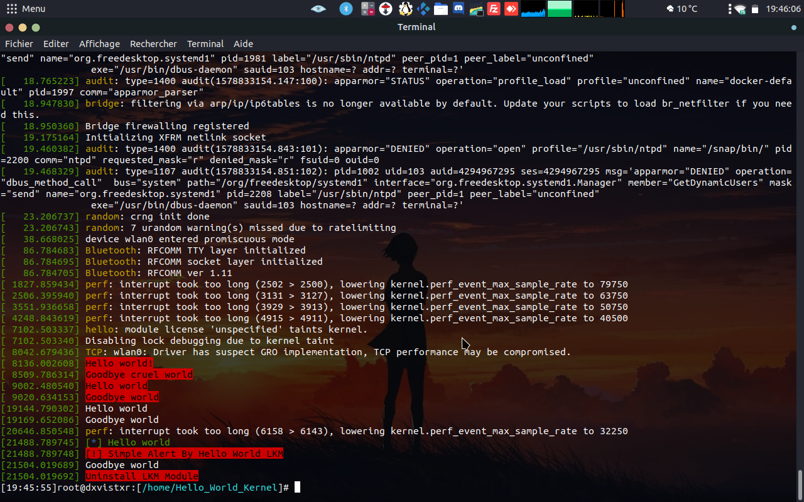

# Hello_World_KLM
Simple Hello World with Kernel Module (Kernel Land)

## How to Create :
  make
  
## For Show Module :
  lsmod or cat /proc/modules

## For Show Informations of LKM:
  modinfo hello_world.ko

## For Run Module :
  insmod hello_world.ko
  dmesg

## For Remove Module :
  rmmod hello_world
  dmesg
