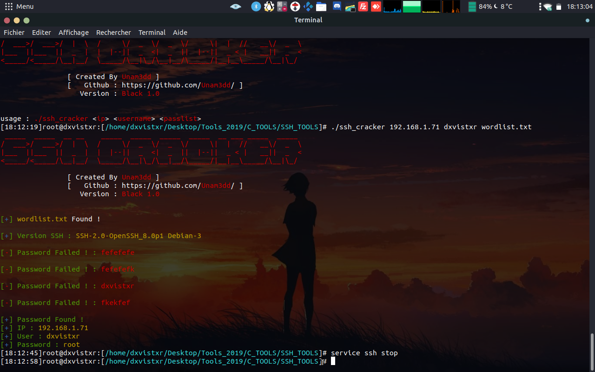

# SSH_Cracker
Simple SSH Cracker in C with libssh and pthread

## Install Requirements :
  apt update && apt install libssh-dev libssh-doc gcc -y

## Compilation command :
  ### Compilation For Script No Thread
      gcc -c ssh_cracker_no_thread.c && gcc ssh_cracker_no_thread.o -o ssh_cracker_no_thread -lssh
  
  ### Compilation For Script With Thread :
      gcc -c ssh_cracker_with_thread.c && gcc ssh_cracker_with_thread.o -o ssh_cracker_with_thread -lssh -lpthread
